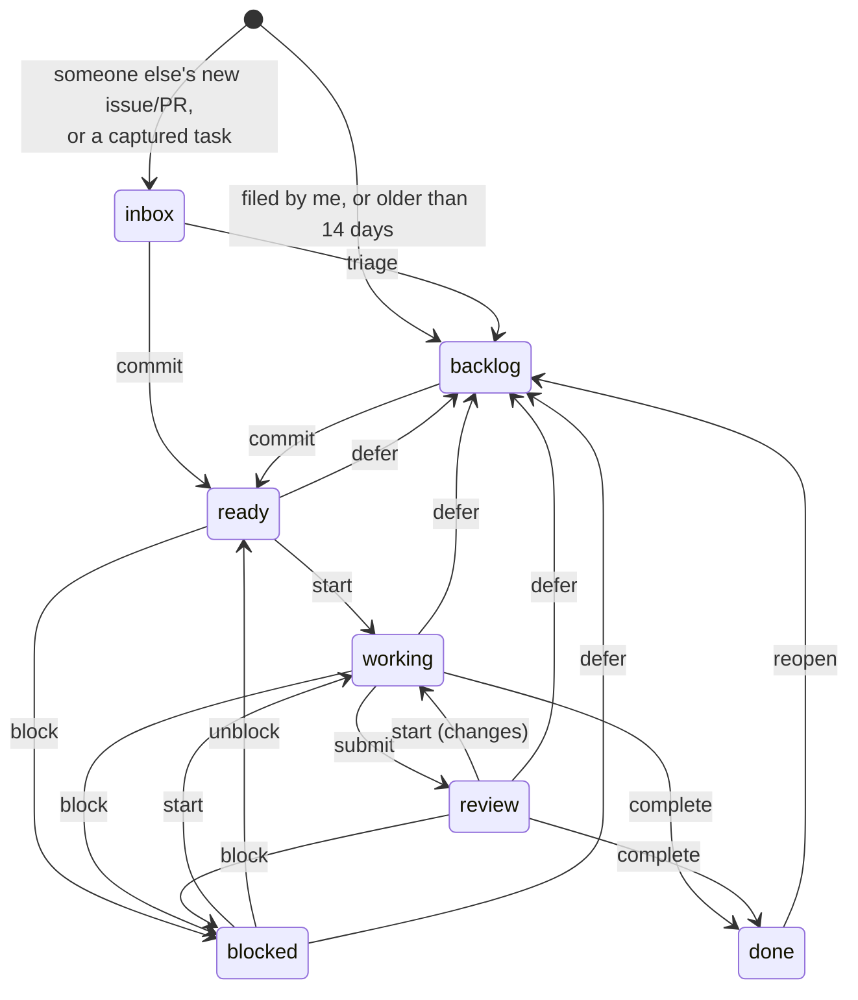

# workplane

[](https://github.com/seandavi/workplane/actions/workflows/ci.yml)

One work queue over GitHub issues, PRs and manual tasks. GitHub stays the system of record; workplane adds what GitHub doesn't have: an inbox for other people's new items, a hard limit on what you've committed to, "waiting on whom", due dates for non-code obligations, and an append-only event log behind every status.

Agents run locally through `work run`: one omp session per GitHub issue, in its own git worktree, streamed live to the dashboard. The service itself never writes to GitHub; the agents you start do (they push a branch and open a PR). **Read [SECURITY.md](SECURITY.md) before you start one.**

workplane is a single-user tool: one person's queue, one SQLite file, no login. Planned work, including isolation for agent runs, is tracked in the [roadmap issues](https://github.com/seandavi/workplane/issues?q=is%3Aissue+label%3Aroadmap).

## Install and run

You need [uv](https://docs.astral.sh/uv/) (it fetches Python 3.13 if you don't have it) and a GitHub token that can read the repos you want to track. `gh auth token` works; for a dedicated token, any token with `repo` (private repos) or `public_repo` scope does, and it is only used to read.

```bash
uv tool install git+https://github.com/seandavi/workplane   # puts `work` and `workplane-server` on PATH
mkdir -p ~/.config/workplane
curl -fsSL https://raw.githubusercontent.com/seandavi/workplane/main/workplane.example.toml \
  -o ~/.config/workplane/config.toml
$EDITOR ~/.config/workplane/config.toml                      # set `me` and `[github] owners`
GITHUB_TOKEN=$(gh auth token) workplane-server               # dashboard on http://127.0.0.1:8642
```

In another terminal:

```bash
work summary
```

The first sync fetches every open issue and PR in the repos you listed. After that it runs every 10 minutes, using issue search for anything updated since the last run. Press **Sync** in the dashboard or run `work sync` to sync right away.

## Configuration

Preferences live in a TOML file: `$WORKPLANE_CONFIG`, else `~/.config/workplane/config.toml` (`$XDG_CONFIG_HOME` is honored). [`workplane.example.toml`](workplane.example.toml) explains every key. Secrets and endpoints come from the environment:

| Variable | Default | |
|---|---|---|
| `GITHUB_TOKEN` | none | Token used to read GitHub. Without it the server runs but never syncs. |
| `WORKPLANE_CONFIG` | `~/.config/workplane/config.toml` | Config file. |
| `WORKPLANE_DB` | `~/.local/share/workplane/workplane.db` | The SQLite file (`$XDG_DATA_HOME` is honored). |
| `SYNC_INTERVAL_SECONDS` | `600` | Background sync interval; `0` turns it off. |
| `HOST`, `PORT` | `127.0.0.1`, `8642` | Where the server listens. |
| `LOG_LEVEL` | `INFO` | |
| `WORK_API_URL` | `http://localhost:8642` | Where the `work` CLI finds the server. |
| `WORK_ACTOR` | the first `me` | Who the CLI acts as. |

Back up the database with `sqlite3 ~/.local/share/workplane/workplane.db ".backup ~/workplane-backup.db"`.

## Run it as a service

**macOS (launchd).** Save as `~/Library/LaunchAgents/local.workplane.plist`, replace `YOU` with your user name (and `/opt/homebrew/bin/gh` with the path from `command -v gh`), then run `launchctl bootstrap gui/$(id -u) ~/Library/LaunchAgents/local.workplane.plist`:

```xml
<?xml version="1.0" encoding="UTF-8"?>
<!DOCTYPE plist PUBLIC "-//Apple//DTD PLIST 1.0//EN" "http://www.apple.com/DTDs/PropertyList-1.0.dtd">
<plist version="1.0">
<dict>
  <key>Label</key><string>local.workplane</string>
  <key>ProgramArguments</key>
  <array>
    <string>/bin/sh</string>
    <string>-c</string>
    <string>export GITHUB_TOKEN="$(/opt/homebrew/bin/gh auth token)"; exec "$HOME/.local/bin/workplane-server"</string>
  </array>
  <key>RunAtLoad</key><true/>
  <key>KeepAlive</key><true/>
  <key>StandardOutPath</key><string>/Users/YOU/.local/state/workplane/server.log</string>
  <key>StandardErrorPath</key><string>/Users/YOU/.local/state/workplane/server.log</string>
</dict>
</plist>
```

**Linux (systemd user unit).** Put `GITHUB_TOKEN=...` in `~/.config/workplane/env` (`chmod 600` it), save as `~/.config/systemd/user/workplane.service`, then `systemctl --user enable --now workplane`:

```ini
[Unit]
Description=workplane

[Service]
EnvironmentFile=%h/.config/workplane/env
ExecStart=%h/.local/bin/workplane-server
Restart=on-failure

[Install]
WantedBy=default.target
```

## Several machines

Install workplane on every machine and run `workplane-server` on one. On the others, point the CLI at it: `export WORK_API_URL=https://your-server`. To reach the server over a tailnet, keep it on `127.0.0.1` and run `tailscale serve --bg 8642` on the server machine; it prints the URL it serves on. A proxy that rewrites the `Host` header (`tailscale serve` may, nginx does by default) makes the dashboard's form posts look cross-site; list the origin the proxy serves in `allowed_origins` in the config.

There is no login: anyone who can reach the port can read and change your queue. Today runners also take their paths (`repo_roots`, `worktree_root`, `state_dir`) from the server's config; per-machine runner config is on the roadmap.

## Model



`complete` and `cancel` are allowed from any open status. GitHub closing, merging or reopening an item is recorded as a fact (`github.closed`, `github.merged`, `github.reopened`) and moves the item only if it is still open here. If you mark an item done, it stays done even while the GitHub issue is still open.

| Concept | Rule |
|---|---|
| **Committed** | `ready`, `working`, `review`, `blocked`. `commit` is refused once `wip_limit` (default 15) is reached unless forced. Concurrent commits are serialized, so they can't push past the limit. |
| **Inbox** | Open issues and PRs from someone other than `me`, created in the last `inbox_window_days`, plus anything you capture. Triage moves an item to the backlog; commit moves it to ready. |
| **Needs you** | Blocked with `waiting_on` = you · in review and claimed by someone else · a GitHub PR requests your review · due within 2 days or overdue ("today" is in the configured `timezone`). |
| **Claim** | `start` claims the item for the actor. If someone else holds the claim, `start` fails unless forced. Unblocking, deferring, completing or cancelling releases the claim. |
| **Noise** | Authors ending in `[bot]`, plus title patterns in `[noise]` (e.g. systemd failure alerts). These items are kept but hidden from the inbox and the default views. |
| **Area** | From repo globs in `[areas]`; can be overridden per item. |

Every change goes through one function (`work.apply_event`). It checks the transition in `domain.decide`, appends to `work_events` and updates the `work_items` projection, all in one transaction.

## CLI

```text
work summary                     counts, WIP vs limit, by area
work needs                       what's waiting on you, and why
work inbox | work ls [--status open|committed|inbox,…] [--area] [--repo] [-q]
work show web-app#59             history + valid commands (also: 42, owner/repo#N)
work add "Reply to the vendor re #48" --area ops --due 2026-10-08 --commit
work commit|triage|start|submit|unblock|defer|done|cancel|reopen REF
work block REF --on bob --reason "needs their call on pricing"
work set REF --priority 1 --due 2026-10-08 --next "draft reply"
work note REF "talked at Thursday meeting"
work sync [--full]
```

Global flags go before the subcommand: `work --as pi start web-app#43`. They are `--as NAME` (actor, default the first `me`; env `WORK_ACTOR`), `--json`, and `--api URL` (env `WORK_API_URL`).

## Agent runs (omp, local)

Needs `git`, the GitHub CLI (`gh`, logged in) and `omp` on your `PATH`, and `approval_mode` set in `[runner]` (see [SECURITY.md](SECURITY.md)).

```bash
work run web-app#33                # worktree + prompt + omp, detached; prints the run id
work tail web-app#33 -f            # tool calls (with omp's intent), failures, turns, cost
work resume web-app#33 "use the build's robots.txt, not a Worker route"
work stop web-app#33               # runner stops omp at its next heartbeat (≤15s)
work runs                          # active + last 24h
```

`work run` runs in the foreground until the run is registered, so mistakes (WIP limit, a claim held by someone else, git trouble) are reported in your terminal. Then a detached runner starts `omp -p --mode json` and reports to the API.

- **Worktree:** `<worktree_root>/<repo>/wp-<N>` on branch `wp/<N>-<slug>`, from `origin/<default>`. It uses your existing clone in one of the `repo_roots` directories if its origin matches; otherwise it clones into `<worktree_root>/_clones/`.
- **Prompt:** the issue, its last 20 comments, and the rules: smallest change, run the tests, push, open a PR with `Closes owner/repo#N`. Never merge, never push to the default branch, never close the issue. If stuck, stop with a message starting `BLOCKED:`.
- **What it does to the work item:** starting a run commits the item if needed (subject to the WIP limit), then `start`s it, claimed by `omp@<host>`. A run that ends with a PR does `submit`, so the item shows under **Needs you** as "ready for your review". A run that ends without a PR does `block` on you, with the agent's last message as the reason. `work resume` gives the agent one more turn in the same omp session (`omp --resume`). Merging the PR closes the issue, and the next sync marks the item done.
- **Visibility:** the dashboard's Agents panel and `/runs/<id>` update live over server-sent events. Each run records turns, tool calls and failures, tokens, cost, the last action, its final message and its PR. A run whose heartbeat is more than 60s old shows as **lost**. Raw omp JSON is in `<state_dir>/runs/` (default `~/.local/state/workplane/runs/`).
- **Limits:** `max_concurrent` runs per host (default 2) and `max_time` per run (default 45m). To continue interactively, run `cd <worktree> && omp -r <session>`; the run page shows the command.

Runs execute with your user's permissions and credentials, and issue text goes into the agent's prompt. Read [SECURITY.md](SECURITY.md).

## API

The JSON API is the surface for the CLI, the runner and, later, agents: `GET /api/work`, `GET /api/work/{id}`, `GET /api/resolve?ref=`, `POST /api/work` (capture), `POST /api/work/{id}/events` (`{"type": "start", "actor": "pi", "payload": {}}`), `GET /api/views/needs-me`, `GET /api/summary`, `GET /api/commands`, `POST /api/sync`. Runs: `POST /api/runs`, `GET /api/runs[?active&work_item_id&since_hours]`, `GET /api/runs/{id}`, `GET|POST /api/runs/{id}/events`, `POST /api/runs/{id}/finish`, `POST /api/runs/{id}/stop`, `GET /api/runner-config`, `GET /api/stream` (SSE). Errors return `{"error", "kind"}` with 404/409/422; a form post that another website caused is refused with 403.

## Develop

```bash
uv sync
uv run pytest        # each test gets its own temporary SQLite file; nothing to start first
uv run ruff check
```

See [CONTRIBUTING.md](CONTRIBUTING.md) for the conventions the code relies on.

## License

[MIT](LICENSE)
