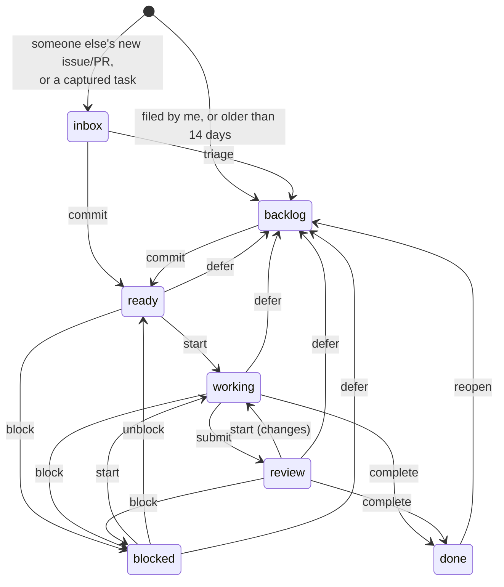

# workplane

One work queue over GitHub issues, PRs and manual tasks. GitHub stays the system
of record; workplane adds what GitHub doesn't have: an inbox for other people's
new items, a hard limit on what you've committed to, "waiting on whom", due dates
for non-code obligations, and an append-only event log behind every status.

This is the task-management core only. Agent sessions, checkouts, leases,
webhooks and durable workflows come later. workplane never writes to GitHub.

## Run it

```bash
echo "GITHUB_TOKEN=$(gh auth token)" > .env    # read-only use; .env is gitignored
docker compose up -d --build                    # Postgres 17 + app on :8642
open http://localhost:8642
```

The first sync fetches every open issue and PR in the repos listed in
`workplane.toml` (about 90 seconds for 339 repos and 905 open items). After that it runs every 10 minutes,
using issue search for anything updated since the last run. Press **Sync** or run
`work sync` to sync right away.

CLI, from this directory:

```bash
uv run work summary
uv tool install -e .     # optional: puts `work` on PATH
```

## Model



`complete` and `cancel` are allowed from any open status. GitHub closing, merging or reopening
an item is recorded as a fact (`github.closed`, `github.merged`, `github.reopened`) and moves the
item only if it is still open here. If you mark an item done, it stays done even while the
GitHub issue is still open.

| Concept | Rule |
|---|---|
| **Committed** | `ready`, `working`, `review`, `blocked`. `commit` is refused once `wip_limit` (default 15) is reached unless forced. Concurrent commits are serialized, so they can't push past the limit. |
| **Inbox** | Open issues and PRs from someone other than `me`, created in the last `inbox_window_days`, plus anything you capture. Triage moves an item to the backlog; commit moves it to ready. |
| **Needs you** | Blocked with `waiting_on` = you · in review and claimed by someone else · a GitHub PR requests your review · due within 2 days or overdue ("today" is in the configured `timezone`). |
| **Claim** | `start` claims the item for the actor. If someone else holds the claim, `start` fails unless forced. Unblocking, deferring, completing or cancelling releases the claim. |
| **Noise** | Authors ending in `[bot]`, plus title patterns in `[noise]` (e.g. systemd failure alerts). These items are kept but hidden from the inbox and the default views. |
| **Area** | From repo globs in `[areas]`; can be overridden per item. |

Every change goes through one function (`work.apply_event`). It locks the row, checks
the transition in `domain.decide`, appends to `work_events` and updates the
`work_items` projection, all in one transaction.

## CLI

```text
work summary                     counts, WIP vs limit, by area
work needs                       what's waiting on you, and why
work inbox | work ls [--status open|committed|inbox,…] [--area] [--repo] [-q]
work show bioc-edge#59           history + valid commands (also: 42, owner/repo#N)
work add "Reply to Bob re #48" --area bioc --due 2026-10-08 --commit
work commit|triage|start|submit|unblock|defer|done|cancel|reopen REF
work block REF --on bob --reason "needs their call on badges"
work set REF --priority 1 --due 2026-10-08 --next "draft reply"
work note REF "talked at Thursday meeting"
work sync [--full]
```

Global flags go before the subcommand: `work --as pi start bioc-edge#43`. They are `--as NAME`
(actor, default the first `me`; env `WORK_ACTOR`), `--json`, and `--api URL` (env `WORK_API_URL`).

## API

The JSON API is what agents will use: `GET /api/work`, `GET /api/work/{id}`,
`GET /api/resolve?ref=`, `POST /api/work` (capture), `POST /api/work/{id}/events`
(`{"type": "start", "actor": "pi", "payload": {}}`), `GET /api/views/needs-me`,
`GET /api/summary`, `GET /api/commands`, `POST /api/sync`. Errors return
`{"error", "kind"}` with 404/409/422.

## Develop

```bash
docker compose up -d db
uv run pytest            # uses a throwaway workplane_test database on :5433
```

The schema avoids arrays and enums (it uses JSONB and CHECK constraints) so it stays portable to
SQLite/D1.
